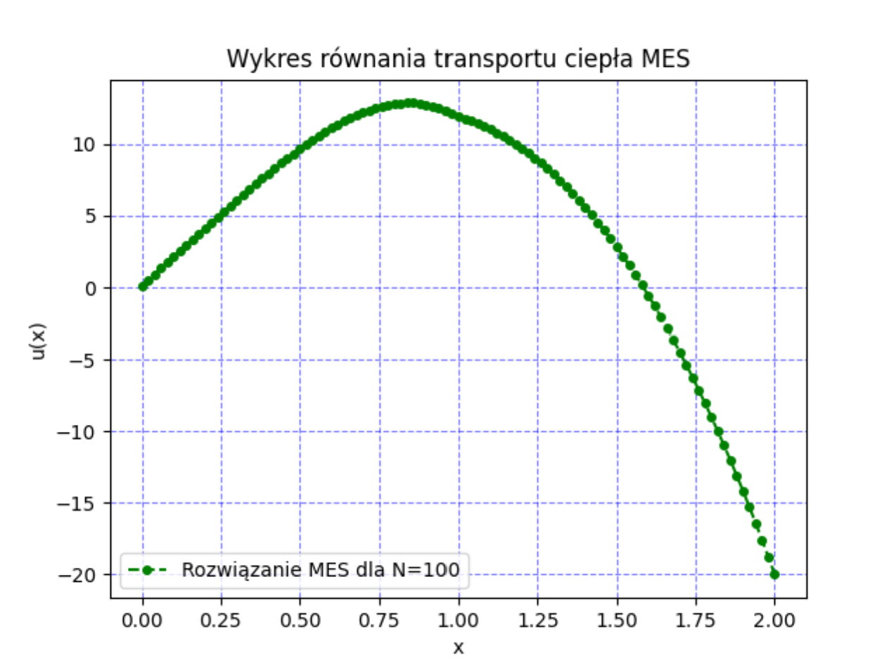

# Rozwiązanie problemu obliczeniowego równania transportu ciepła metodą elementów skończonych (MES)

Zadanie obliczeniowe wykonane w ramach realizowania przedmiotu Równania Różniczkowe i Różnicowe.

[Problem](SformulowanieWariacyjne.pdf) został rozwiązany przy użyciu Pythona wraz z bibliotekami numpy oraz matplotlib.

# Wykres dla N=100

  

